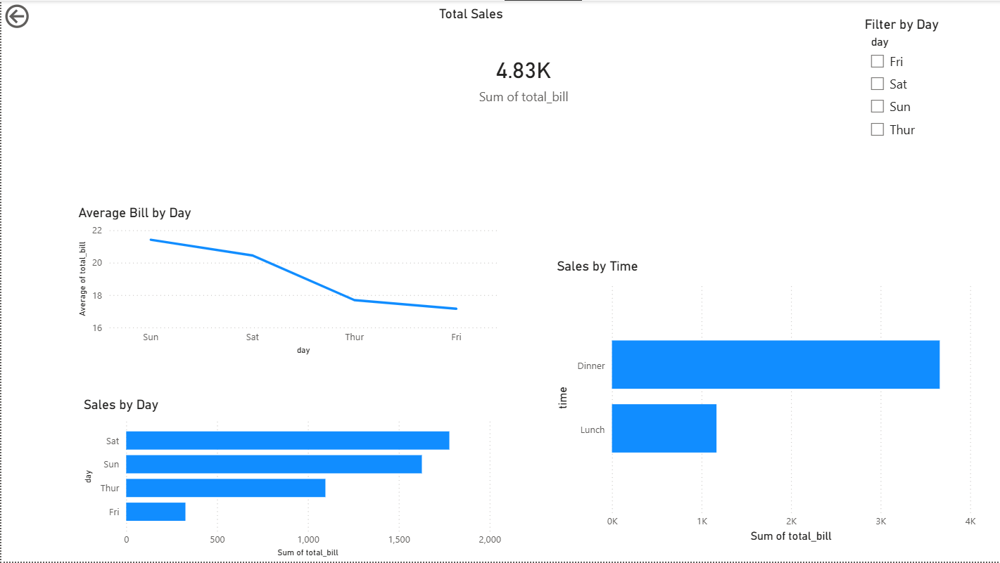

# Sales Data Exploratory Analysis

## Tools Used
- Python (Pandas, NumPy, Matplotlib)

## Project Overview
This project performs exploratory data analysis on sales transaction data to identify trends and patterns in customer spending.

## Key Analysis Performed
- Data loading and inspection
- Data cleaning and validation
- Exploratory data analysis (EDA)
- Feature engineering (tip percentage)
- Visual analysis of sales trends

## Key Insights
- Higher average bills observed on weekends
- Dinner contributes more to total sales than lunch
- Tip percentage remains relatively consistent

## Project Link
- Google Colab Notebook: https://colab.research.google.com/drive/1SfZDxlVZ5EOQel7ywn2udBJ7_vpIRVvx?usp=sharing

## Power BI Dashboard

The dashboard was created using Power BI Desktop to visualize sales trends and customer behavior.

### Dashboard Preview

